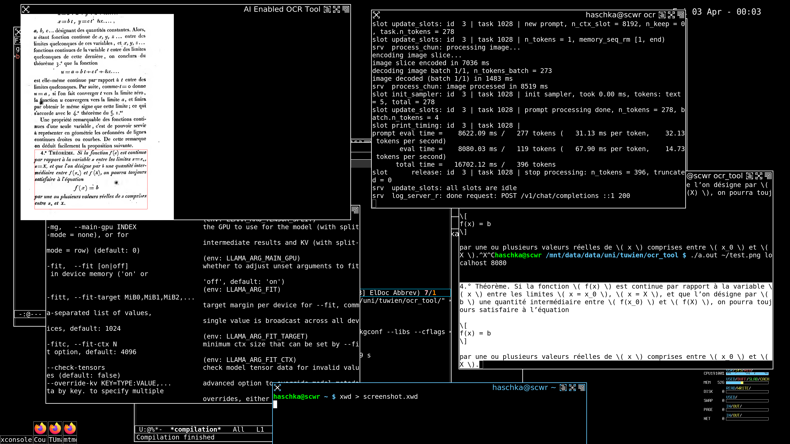

# ocr_tool
A tool to perform ocr with ai OCR model and an inference engine like llama.cpp

## Installation:

The tool is dependent on glib-2.0, libpng, json-c, SDL2, and a
pthreads implemenation. Please install typical compilier, build tools
according to your distribution. I.e. build-essentials and the dev
packages of the dependent libraries.

Successful compilation can in general be achieved like:
```
gcc -O2 -march=native ocr_tool.c local_resolve.c `sdl2-config --libs` \
`pkgconf --libs --cflags glib-2.0` -lcurl -lpng -ljson-c -pthread \
-o ocr_tool
```
## General Usage:
The tool requires an inference provider with OCR
capabilities. Currently the tool does not connect to SSL enabled
servers, nor does it accept api keys in the current version. Inference 
for OCR use cases can easily be run on the local machine on the CPU
with reasonable good models. The tool was mainly tested with 
*Deepseek-OCR* though other models may work. A suggested workflow is:

1. Download Deepseek-OCR, i.e. from huggingface:
   https://huggingface.co/ggml-org/DeepSeek-OCR-GGUF/tree/main
   You need both `DeepSeek-OCR-Q8_0.gguf` and
   `mmproj-DeepSeek-OCR-Q8_0.gguf`

2. Install llama.cpp:
   https://github.com/ggml-org/llama.cpp
   i.e. from the website or from your distribution.
   
3. Run the llama.cpp with the OCR model:
   ```
   llama-server -m DeepSeek-OCR-Q8_0.gguf \
   --mmproj mmproj-DeepSeek-OCR-Q8_0.gguf \
   --hostname localhost --port 8080
   ```
   
4. Run the tool and select a text region:
   ```
   ./ocr-tool test.png localhost 8080
   ```
   Detected text is automatically written to stdout
   
5. Quit the tool by hitting the ESCAPE key. 

## Keybindings:

- `q`-key kills the current request to the inference provider
  (i.e. llama.cpp). Some models will take a long time to respond,
  i.e. if the selected area contains no text. This key allows you to
  cancel a request.
  
- `ESC`-key quits the program

## Trivia:
The provided test image `test.png` is taken from:

Cours d'analyse de l'École royale polytechnique

by Cauchy published in 1821.

## Screenshot:



  
  
